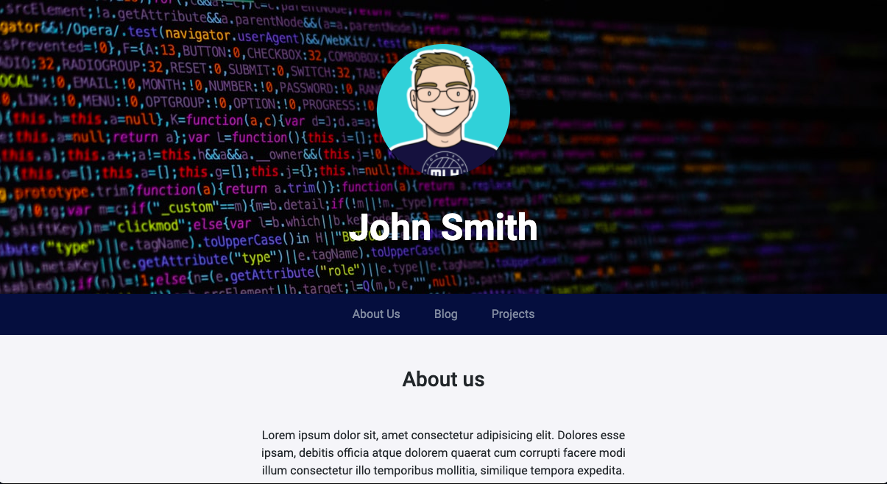
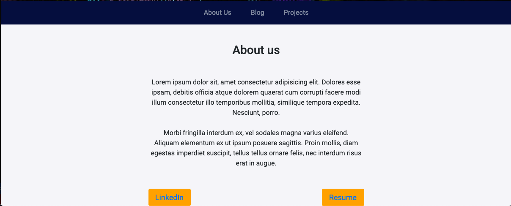
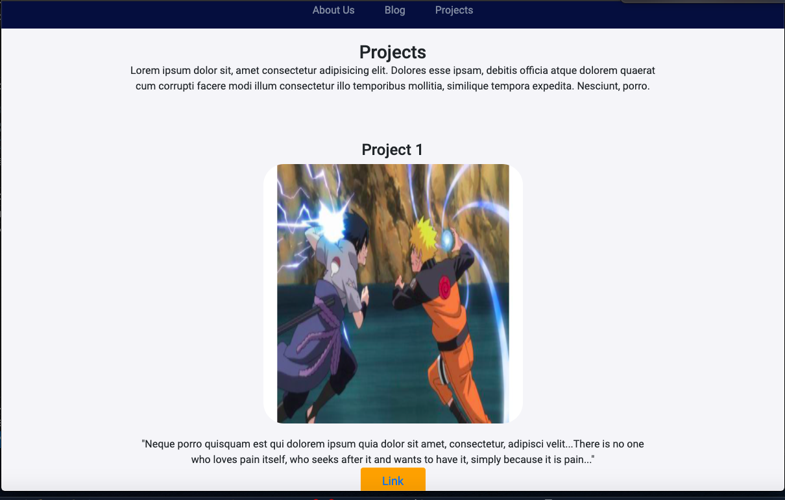
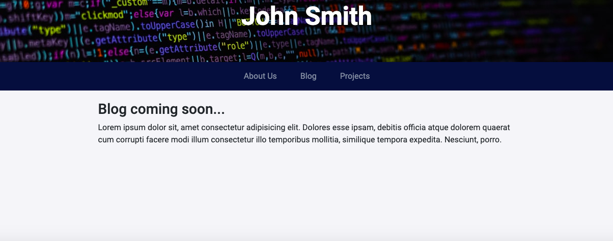

# Flask-Blog

Flask Portfolio Template

## Installation

Make sure you have python3 and pip installed


Create and activate virtual environment using virtualenv
```bash
$ python -m venv python3-virtualenv
$ source python3-virtualenv/bin/activate
```

Use the package manager [pip](https://pip.pypa.io/en/stable/) to install all dependencies

```bash
pip install -r requirements.txt
```

## Usage


Create a .env file using the example.env template


Start flask development server
```bash
$ export FLASK_ENV=development
$ flask run
```

## Contributing
Pull requests are welcome. For major changes, please open an issue first to discuss what you would like to change.

Please make sure to update tests as appropriate.

## Flask Backend
The Flask backend is located in the __init_.py file. It brings in flask and dotenv as dependencies. Flask brings in render_template, send_from_directory, request, and redirect in order to get it to speak to the frontend part of the app.

```
import os
from flask import Flask, render_template, send_from_directory, request, redirect
from dotenv import load_dotenv

load_dotenv()
app = Flask(__name__)
```

There is one route each to the home page, about section, blog section, and project section (the home page is currently the same as the about page). Group members may add a contact section at a later point. All routes follow a similar format to the one below:

```
@app.route('/')
def index():
   return render_template('aboutPage.html', title="John Smith", url=os.getenv("URL"))
```

## Frontend - HTML Child Templates
The Frontend utilizes a base.html file that renders the templates for all subsequent html pages on the site. The profile picture and name are displayed on all pages, followed by a navblock or body block. 

```
<div class="profile">
        <div id="profile-picture" class="profile-picture">
            
        </div>
        <h1>{{ title }}</h1>
    </div>

    
    

    
    
```
These blocks are implemented only in the html files that they are specifically extended to. The index.html file only extends the navbar, as shown below:

```
 
<nav class="navbar navbar-dark navbar-expand-sm">
  <div class="nav-container">
    <!-- <button class="navbar-toggler" type="button" data-toggle="collapse" data-target="#Navbar">
            <span class="navbar-toggler-icon"></span>
        </button> -->

    <ul class="navbar-nav mr-auto">
      <li class="nav-item"><a class="nav-link" href="./about">About Us</a></li>
      <li class="nav-item"><a class="nav-link" href="./blog">Blog</a></li>
      <li class="nav-item">
        <a class="nav-link" href="./projects">Projects</a>
      </li>
    </ul>
  </div>
</nav>

```

While the aboutPage.html, blogPage.html, and projectsPage.html pages extend the body block. The aboutPage.html code is shown below:

```
 

    <div class= 'container'>
        <br />
        <h3 style="text-align: center; margin: 0 auto;">About us</h3>
        <br /> <br />
        <p class="aboutMe" style="width:500px; text-align: center; margin: 0 auto;">Lorem ipsum dolor sit, amet consectetur adipisicing elit. Dolores esse ipsam, debitis officia atque dolorem quaerat cum corrupti facere modi illum consectetur illo temporibus mollitia, similique tempora expedita. Nesciunt, porro.</p>
        <br />
        <p class="aboutMe" style="width:500px; text-align: center; margin: 0 auto;">Morbi fringilla interdum ex, vel sodales magna varius eleifend. Aliquam elementum ex ut ipsum posuere sagittis. Proin mollis, diam egestas imperdiet suscipit, tellus tellus ornare felis, nec interdum risus erat in augue.</p>
        <br /> <br />
        <div class='btn-container'>        
            <button class = 'btn' ><a href="https://linkedin.com" target="_blank">LinkedIn</a></button>
            <button class = 'btn' ><a href="#" target="_blank">Resume</a></button>
        </div>
    </div>
 
```

As seen here, while both the navbar block and body block are declared in the base.html, they are only used in the files that those blocks are specifically extended toward. 

## Website

Here are some images of our site below:

Home/About Page: 




Projects Page: 

Blog Page: 


## Additional Resources used
1) FreeCodeCamp Flask Tutorial on YouTube: https://www.youtube.com/watch?v=Z1RJmh_OqeA
2) Additional page to help with installing Python packages (there was an issue using the command given): https://www.mytecbits.com/internet/python/installing-python-packages
3) Filler text: https://www.lipsum.com/feed/html
4) W3Schools Python Tutorial: https://www.w3schools.com/python/python_getstarted.asp
5) Flask Quickstart Documentation Guide: https://flask.palletsprojects.com/en/1.1.x/quickstart/


